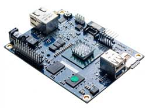

## Legacy MinnowBoards

Below are the legacy MinnowBoards which have been released.

| [MinnowBoard\MAX](minnowboard-max)  | 2014  |
|---|---|
|   | MinnowBoard MAX is the second generation MinnowBoard (released in July 2014). The MinnowBoard MAX board has an upgraded 64-bit Intel® Atom™; E3800 (Bay Trail-I) processor with better graphics, revised I/O and a smaller footprint. |

___

| [MinnowBoard v1](minnowboard-v1)  | 2012  |
|---|---|
|   | This is the first MinnowBoard (released in 2012). The MinnowBoard is a compact and affordable open source hardware reference platform that puts the power of a 64-bit Intel® Atom™ E38xx Series SoC in a small versatile form-factor|
